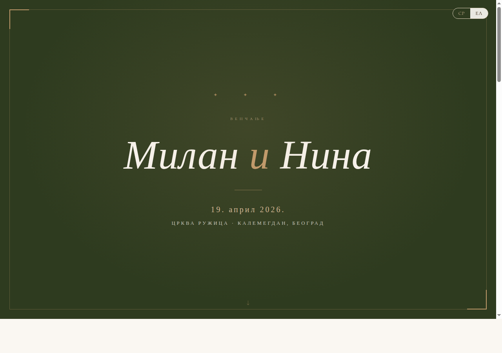

# Венчање — Милан и Нина

Позивница за венчање — статична веб страница са RSVP формом.



## Детаљи

| | |
|---|---|
| **Датум** | 19. април 2026. |
| **Венчање** | Црква Ружица, Калемегдан — 13:30 |
| **Ручак** | Мезесторан Двориште — 15:00–18:00 |
| **RSVP рок** | 20. март 2026. |

## Језици

- **Српски (ћирилица)** — подразумевани
- **Грчки** — `?lang=el`

## Покретање

```bash
node server.js
```

Сервер слуша на порту `7000` (може се мењати преко `PORT` env варијабле).

| URL | Опис |
|---|---|
| `http://localhost:7000` | Позивница |
| `http://localhost:7000?lang=el` | Грчка верзија |
| `http://localhost:7000/submissions` | RSVP пријаве (`admin` / `vencanje2025`) |
| `http://localhost:7000/data/submissions.csv` | Скини CSV |

## Структура

```
index.html          # позивница (HTML + CSS + JS)
server.js           # Node.js сервер са gzip компресијом
rsvp.php            # PHP алтернатива за RSVP бекенд
submissions.php     # PHP алтернатива за прегледач пријава
data/
  submissions.csv   # RSVP пријаве (аутоматски креиран)
```

## Конфигурација

На врху `<script>` блока у `index.html`:

```js
const CONFIG = {
  date:         '19. април 2026.',
  venueName:    'Мезесторан Двориште',
  venueAddr:    'Београд',
  mapUrl:       'https://maps.google.com/?q=Mezestoran+Dvoriste+Beograd',
  rsvpDeadline: '20. март 2026.',
};
```
